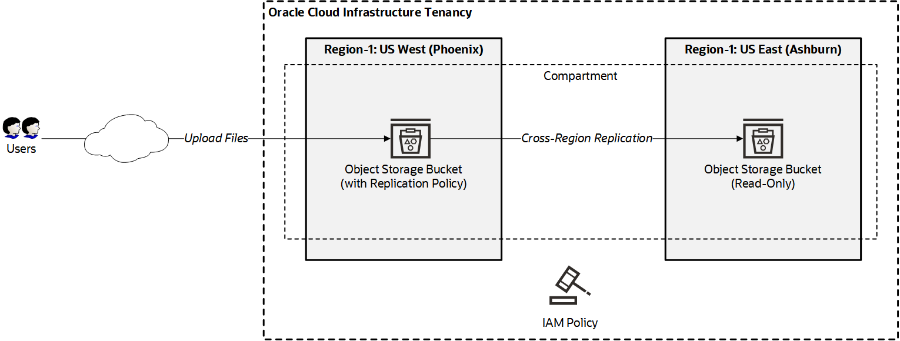

# Deploy Resources Across Multiple Oracle Cloud Regions
This Terraform configuration demonstrates the use of the [provider alias feature](https://www.terraform.io/docs/configuration/providers.html#alias-multiple-provider-configurations) to automate the deployment of Oracle Cloud Infrastructure resources across multiple regions.
- [Scenario](#scenario)
- [Usage Instructions](#usage-instructions)
  - [Provision Resources](#provision-resources)
  - [Remove Resources](#remove-resources)

## Scenario
For this demonstration, we implement cross-region Object Storage replication by creating the following resources.
- An IAM policy in the home region of the tenancy, to allow the Object Storage service in a primary region (designated by you) to manage buckets in a compartment that you specify.
- Two Object Storage buckets, one in a primary region and the other in a standby region. You specify the regions.
- An Object Storage replication policy in the primary region to copy objects from the bucket in the primary region to the bucket in the standby region.
The resources are created in the following order:
**Note**: An explicit dependency is defined in `xregion_replication_policy.tf` to ensure that Terraform creates the cross-region Object Region replication policy only after the two buckets and the required IAM policy are created.

The following diagram shows the architecture:



## Usage Instructions
### One-Click Deployment
[](https://console.us-phoenix-1.oraclecloud.com/resourcemanager/stacks/create?region=home&zipUrl=one-click.zip)
### Provision Resources Using the Terraform CLI
1. Complete the prerequisites described in https://github.com/oracle-quickstart/oci-prerequisites.
2. Configure the necessary IAM permissions.
   
   See [Required IAM Policies](https://docs.cloud.oracle.com/en-us/iaas/Content/Object/Tasks/usingreplication.htm#permissions). 
   
   If you don't have administrator privileges to create policies, contact your tenancy administrator.
2. Clone this repository.
  ```
  git clone https://github.com/kumar-dhanagopal/multi-region-provider-alias-demo.git
  cd multi-region-provider-alias-demo
  ```
3. Copy `terraform.tfvars.example` in the top-level directory to `terraform.tfvars`.
4. Open `terraform.tfvars` in a plain-text editor, and specify values for the variables in the file.
5. Initialize Terraform.
  ```
  terraform init
  ```
6. Review the plan.
  ```
  terraform plan
  ```
7. Apply the configuration.
  ```
  terraform apply
  ```
  
  When you’re prompted to confirm the action, enter **yes**.
  
  When all components have been created, Terraform displays a completion message. 
  
  For example:
  ```
  Apply complete! Resources: 4 added, 0 changed, 0 destroyed.
  ```
  
  **Note**: Before creating the Object Storage replication policy, Terraform needs to wait for the IAM policy that allows the object-storage replication to be propagated across all the regions. The code includes a `time_sleep` resource that forces Terraform to wait 15 seconds after IAM policy is created. You can change this wait time by using the `wait_before_creating_xregion_replication_policy` variable in `terraform.tfvars`.
  
  If the wait time specified isn't enough, the following error message is displayed:
  ```
  Error: Service error:InsufficientServicePermissions.
  Permissions granted to the object storage service in this region are insufficient to execute this policy.. 
  http status code: 400. Opc request id: iad-1:...

  on xregion_replication_policy.tf line 1, in resource "oci_objectstorage_replication_policy" "replication_policy":
   1: resource "oci_objectstorage_replication_policy" "replication_policy" {
  ```
  If this error occurs, wait a few seconds to allow the IAM policy to propagate across all the regions, and then run `terraform apply` again. Consider increasing the wait time to prevent this error in the future.

### Remove Resources
To delete all the resources, including the buckets, run the following command:
 ```
  $ terraform destroy
  ```
  When you’re prompted to confirm the action, enter **yes**.
  
  If the buckets are not empty, the following error occurs:
  ```
  Error: Service error:BucketNotEmpty.
  Bucket named 'standby' is not empty.
  Delete all object versions first.. 
  http status code: 409. Opc request id: phx-1:2...

  Error: Service error:BucketNotEmpty.
  Bucket named 'primary' is not empty.
  Delete all object versions first..
  http status code: 409. Opc request id: iad-1:...
  ```
If you want to delete the buckets as well, then remove all the objects from the buckets (using the web console, CLI, or any other interface), and then run the following command:
 ```
  $ terraform destroy
  ```
  When you’re prompted to confirm the action, enter **yes**.
